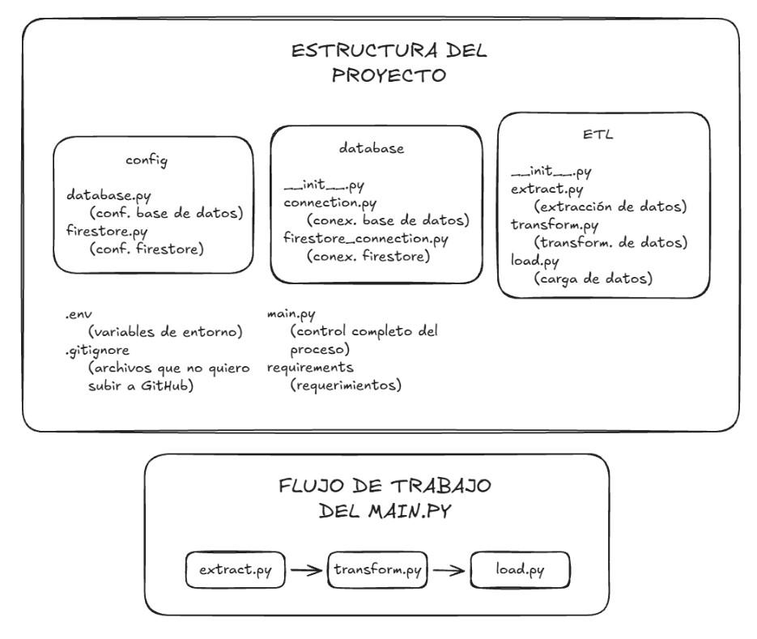
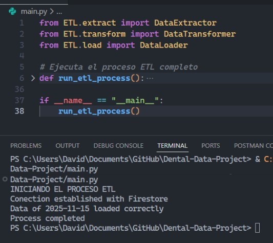
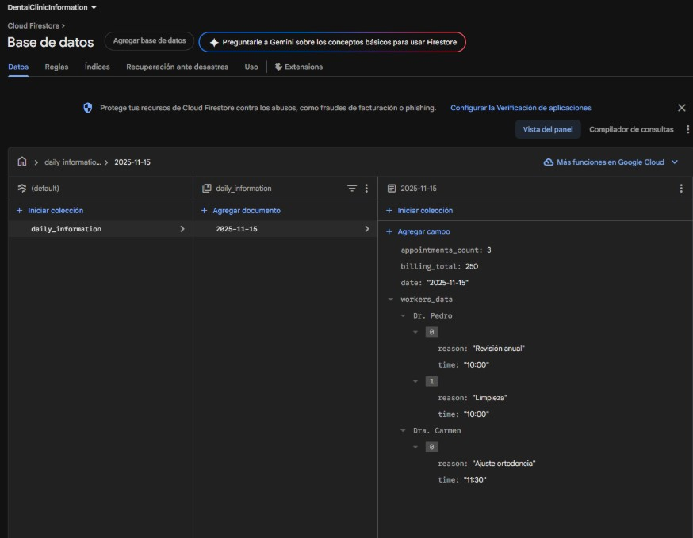

# ☕ Clinic data extractor

Clinic Data Extractor es una herramienta diseñada para automatizar el flujo completo de extracción y gestión de datos clínicos.
El proyecto implementa un proceso ETL (Extract, Transform, Load) que obtiene información desde una base de datos SQL, la procesa para dejarla en un formato coherente y estructurado, y finalmente la exporta a Google Firestore para su uso posterior por analistas, dashboards o aplicaciones externas.

Su objetivo principal es centralizar datos distribuidos en diferentes tablas, normalizarlos y dejarlos accesibles en la nube de forma automatizada y fiable.


## 📂 Estructura del proyecto

```
.
├── config
│   └── database.py
│   └── firestore.py
│
├── database
│   ├── __init__.py
│   ├── connection.py
│   ├── firestore_connection.py
│
├── ETL
│   ├── __init__.py
│   ├── extract.py
│   ├── load.py
│   ├── transform.py
│
├── main.py
├── env.example.py
├── .gitignore
├── requirements.txt
└── README.md
```


## 🚀 Funcionalidades

- Extracción de datos desde SQL
    Obtiene información desde la base de datos local utilizando conexiones seguras configuradas en el proyecto.
- Transformación de datos
    Filtra, limpia y estructura los datos obtenidos para adaptarlos al modelo necesario antes de ser enviados a Firestore.
- Carga automática en Firestore
    Envía la información ya transformada a colecciones específicas dentro de Google Firestore.
- Arquitectura modular basada en ETL
    El proyecto está dividido en módulos independientes: extract, transform, load, y conexiones de base de datos, lo que facilita mantenimiento y extensibilidad.
- Gestión centralizada de configuración
    Uso de archivos dedicados para configurar credenciales, conexiones y variables de entorno.
- Preparado para automatización
    Puede ejecutarse de forma programada o integrarse con otros servicios para sincronizaciones periódicas.

## 🧪 Tecnologías

- Python
- SQL
- Google Firestore (Firebase)


## 📸 Capturas de pantalla






## 👩‍💻 Contacto

Si quieres ver más proyectos o ponerte en contacto conmigo:

- [GitHub](https://github.com/davidrguez98)
- [LinkedIn](https://www.linkedin.com/in/david-rodr%C3%ADguez-p%C3%A9rez-softdev/)
- Correo: ropeda98@gmail.com
